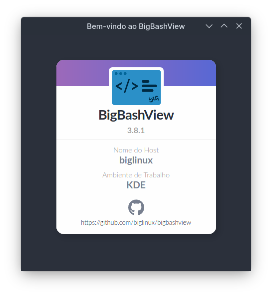
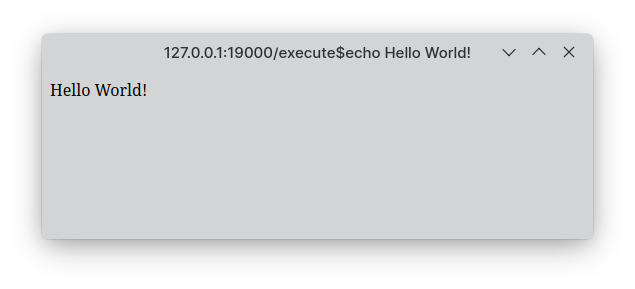

# BigBashView


Graphical Frontends for ShellScripts using HTML/JS/CSS

Is a interface for rendering bash output using QWebEngine or WebKitGtk2.
It rendering also supports a wide variety of languages, such as Python, Ruby, Perl and PHP.

## Advantages

- Create powerful frontend using common known languages, such as HTML, JS and Shell!
- Demo for all functions available!
- Smooth learning curve!

## Pré-requisites

- Python >= 3.0
- Git >= 2.0

## Install

### Arch Based

```sh
# Python dependencies
pip install web.py
pip install setproctitle
pip install PyQt6-WebEngine
pip install PyQtWebEngine

# Clone project
git clone git@github.com:biglinux/bigbashview.git
cd bigbashview/pkgbuild/

# Remove broken dependencies
sed -Ei 's/depends/\#depends/' PKGBUILD

# Compile and install
makepkg -si

# Test
bigbashview 'execute$echo Hello World!'
```

<p align="center">
  
</p>

## Usage

To run BigBashView, you must execute the bigbashview.py script.
There are serveral command line arguments that can be used as following:

```sh
./bigbashview.py [-h|--help] [-s|--screen=widthxheight] [-v|--version] [-t|--toolkit=[gtk|qt|]] [-w|--window_state=[normal|maximized|fullscreen]] [-i|--icon image] [-c|--compatibility-mode] [-r|--root] [-d|--debug] URL
```

Where URL is a URL or a server path as documented bellow

```sh
Options

-h, --help
Show the list of available options and exit

-s, --screen=widthxheight
Change the screen size for a specific widthxheight

-v, --version
Show version number and exit

-t, --toolkit=[gtk]
Chooses the graphical toolkit to use. QT(5) or GTK(3) UI

-w, --window_state=[normalximized|fullscreen]
Change how the window will show, it can be normal, maximized or fullscreen

-i, --icon=image
Change BigBashView window icon

-c, --compatibility-mode
Enables BigBashView compatibility mode

-r, --root
Disable sandbox in QT UI for work as root. *only 

-d, --debug
Enable remote debugging *only 
```

## Test

To create a hello world window, just call BigBashView as follows:

```sh
./bigbashview.py 'execute$echo Hello World!'
```

<p align="center">
  
</p>

To create a more fancy hello world, you coud try to create a script and call it, as follows:

```sh
vim hello.sh
```

```sh
#!/usr/env/bin bash
echo "
<html>
  <head>
    <title>Hello World at BigBashView</title>
  </head>
  <body>
    <h1>Hello $USER!</h1>
    <p>`date`</p>
  </body>
</html>
"
```

```sh
$chmod +x hello.sh
./bigbashview.py 'execute$hello.sh'
```

## Server Options

As you saw above, to execute the _hello.sh_ script, we used _execute$_

This syntax works like this:

```sh
command <options>$ <value>
```

The available commands are:

<table>
  <tr>
    <th>Command</th>
    <th>Description</th>
  </tr>
  <tr>
    <td><code>execute</code></td>
    <td>execute <code>value</code> in your shell environment, and returns to the page everything that was printed to stdout</td>
  </tr>
  <tr>
    <td><code>content</code></td>
    <td>returns the contents of the file at `<value>`</td>
  </tr>
</table>

The available options are:

<table>
  <tr>
    <th>Option</th>
    <th>Description</th>
  </tr>
  <tr>
    <td><code>plain</code></td>
    <td>Set the web header Content type to text/plain</td>
  </tr>
  <tr>
    <td><code>close</code></td>
    <td>_only for execute command_ Closes BigBashView after <code>value</code> execution</td>
  </tr>
</table>

This same syntax can be used in URLs on links, images and everything on your webpage, just remember to put a _/_ before to use it.

To get some examples on how to use server options, see the folder _server_options_ inside the demos folder of your BigBashView package

## Creating Forms

After creating a form, set it on the action to send to server to execute the script. for example:

```html
<form action="execute$./process_form.sh"></form>
```

in the process_form.sh you will get all post (or get) values in system variables named like:

```sh
p_fieldname
```

To get an example on how to create a form, see the folder _form_ inside the demos folder of your BigBashView package

## Common JavaScript and HTML Tips

Some HTML and JavaScript window manipulations will work on BigBashView windows.

<table>
  <tr>
    <th>Lang</th>
    <th>Event</th>
    <th>Action</th>
    <th>Work</th>
  </tr>
  <tr>
    <td>HTML/JavaScript</td>
    <td><code>on</code></td>
    <td>Behavior on BigBashView Window</td>
    <td>All</td>
  </tr>
  <tr>
    <td>HTML</td>
    <td><code>&lt;title&gt;</code></td>
    <td>Change window title</td>
    <td>All</td>
  </tr>
  <tr>
    <td>HTML</td>
    <td><code>&lt;link rel=&quot;shortcut icon&quot; href=&quot;&quot;&gt;</code></td>
    <td>Change window icon</td>
    <td>_only Q</td>
  </tr>
  <tr>
    <td>JavaScript</td>
    <td><code>window.close</code></td>
    <td>Closes the window</td>
    <td>All</td>
  </tr>
  <tr>
    <td>JavaScript</td>
    <td><code>window.resizeTo</code></td>
    <td>Resizes the window</td>
    <td>_only GT</td>
  </tr>
  <tr>
    <td>JavaScript</td>
    <td><code>window.moveTo</code></td>
    <td>Moves the window</td>
    <td>_only GT</td>
  </tr>
</table>

To see those JavaScript and HMTL tips in action, see the folder _javascript_html_tips_ inside the demos folder of your BigBashView package

## Closing the Window

As you can see [here](http://code.google.com/p/bigbashview/issues/detail?id=2), there are some issues related to JavaScript window.close when the window has navigated.

To workaround this, you can tell server to shutdown the application, calling the _close_ option like this:

```html
<a href="execute close$">Close the window</a>
```

This option will only work with the execute command.
Optionally you can, in your script, print "False" to stderr so the server will not close the window, like that:

```html
<a href="execute close$echo False">This does not close the window</a>
```

This way you can show a dialog confirmation before closing the window.

To get some examples on how to use this syntax, see the folder _window_close_ inside the demos folder of your BigBashView package.

## Compatibility Mode

To enable the compatibility mode, you need to use the _-c_ or _--compatibility-mode_ argument option when starting the application.

- The urls cannot contain `file://`, only the absolute path for the file
- You need to use the absolute path for the file. Relative paths wont work
- The old HTML tag `<scripttool>` is not available even in compatibility mode

In comptibility mode, the URLs will not contain commands, just the path for the file. BigBashView will try to guess what to do with the file according its extension.

<table>
  <tr>
    <th>Extension</th>
    <th>BBV Action</th>
  </tr>
  <tr>
    <td>.sh,.sh.html,.sh.htm</td>
    <td>Execute the file and return the result as HTML</td>
  </tr>
  <tr>
    <td>.htm, .html</td>
    <td>Open the file and return its content as HTML</td>
  </tr>
  <tr>
    <td>.txt</td>
    <td>Open the file and return its content as TXT</td>
  </tr>
</table>

To get some examples on how to use compatibility mode, see the folder _compatibility_mode_ inside the demos folder of your BigBashView package.


Claro, aqui está uma documentação em inglês, formatada em Markdown, para a sua implementação de inclusão de conteúdos e execução de scripts no servidor Python com a classe `content_handler`. A documentação inclui uma descrição geral, instruções de uso e exemplos.

---

### HTML Inclusion

To include an HTML file, use the following syntax in your HTML:

```html
<?include html path/to/file.html?>
```

### Script Execution

To execute scripts, embed them within the following tags:

- **Bash:**
  ```html
  <?include bash
  # Your bash commands here
  ?>
  ```

- **PHP:**
  ```html
  <?include php
  # Your PHP code here
  ?>
  ```

- **PYTHON:**
  ```html
  <?include python
  # Your Python code here
  ?>
  ```
  
- **Node.js:**
  ```html
  <?include node
  # Your Node.js code here
  ?>
  ```

## Examples

### Including an HTML File

```html
<!-- Include a navigation bar -->
<div>
    <?include html components/navigation.html?>
</div>
```

### Executing a Bash Script

```html
<!-- List files in the root and home directories -->
<div>
    <?include bash
    ls /
    ls /home
    ?>
</div>
```

## Legacy Refrences

- Visit [BigLinux Blog](https://biglinux.blogspot.com/2009/07/bigbashview-em-busca-da-revolucao.html) and [BigBashView's section](https://github.com/biglinux/bigbashview/blob/master/bigbashview/usr/share/bigbashview/README.md)
- Check out our [legacy page on Google Code](https://code.google.com/archive/p/bigbashview/wikis/Documentation.wiki)
